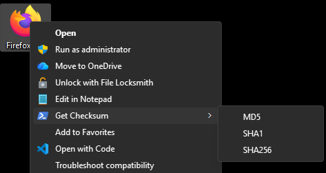

# Modifications

This fork gets hash values in uppercase using the PowerShell Get-FileHash command instead of the original certutil, which returned values in lowercase.

Additional changes:
- Displays a popup message showing the copied hash value with algorithm confirmation
- Uses PowerShell icons in the context menu

# hashfile-contextmenu

Add commands to get a hash string of a file to context menu of Windows Explorer.  
The hash string is copied to clipboard and displayed in a popup message.

Hash Algorithm: MD5, SHA1 and SHA256

## Install

**Cascading Menu:**  
Open `hashfile-contextmenu-add.reg` file to add a "Get Checksum" menu with MD5, SHA1, and SHA256 as submenu options.

**Individual Menu Entries:**  
Open individual files to add separate top-level menu entries:
- `hashfile-contextmenu-add-MD5.reg` - Adds "Get MD5" menu entry
- `hashfile-contextmenu-add-SHA1.reg` - Adds "Get SHA1" menu entry  
- `hashfile-contextmenu-add-SHA256.reg` - Adds "Get SHA256" menu entry

## Uninstall

Open `hashfile-contextmenu-remove.reg` file to remove all context menu entries.
